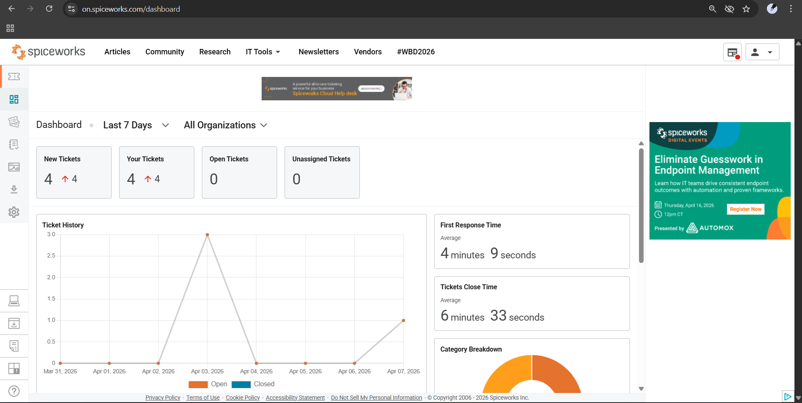
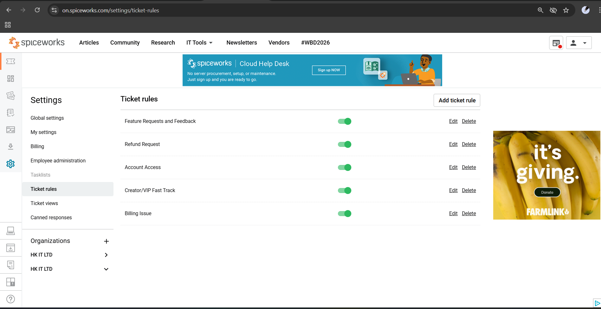
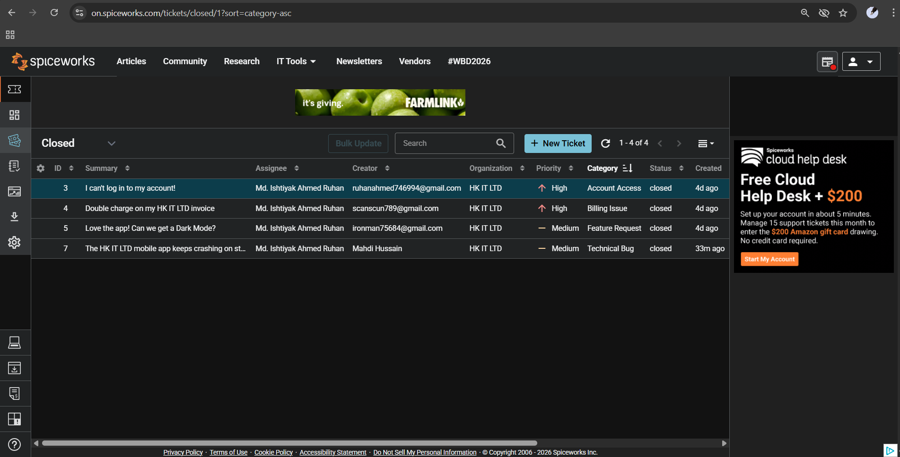
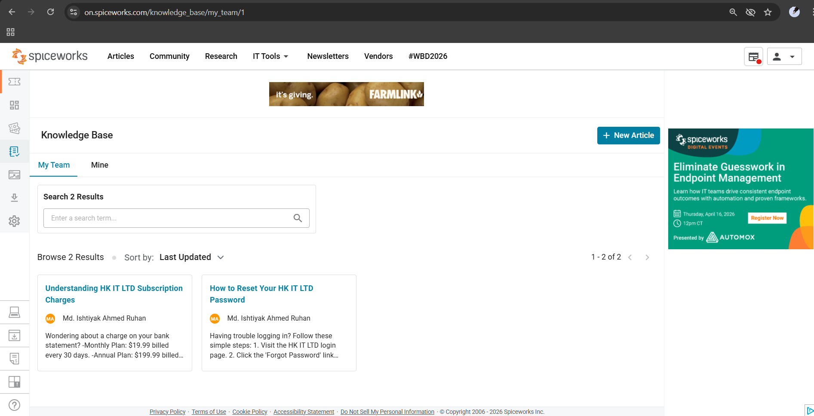

# HK IT LTD - Customer Support Portfilo

**Objective:** Architected and managed a high-velocity Customer Support ecosystem for **HK IT LTD**, a simulated mobile application. This project showcases expert-level configuration of **Spiceworks Cloud Help Desk** to handle real-world B2C (Business-to-Consumer) support cycles, emphasizing rapid response times and multi-category triage.

**Core Competencies:**
* **Platform:** Spiceworks Cloud Help Desk  
* **Frameworks:** Ticket Triage (Tier 1-3), SLA (Service Level Agreement) Compliance  
* **Specialties:** Financial Escalation, Technical Bug Reporting, Knowledge Base (KB) Design

---

## 🛠️ Phase 1: Helpdesk Architecture & Schema
To align the system with the **HK IT LTD** business model, I overhauled the standard ITIL categories. I implemented a B2C-focused taxonomy to ensure that customer-facing issues were routed with 100% accuracy.

* **Primary Categories:** Billing Issue, Account Access, Technical Bug, Feature Request.
* **Infrastructure:** Configured mandatory attributes to capture user data immediately upon ticket creation, reducing back-and-forth communication.

---

## ⚙️ Phase 2: Logic-Based Automation & Triage
I engineered an automated triage engine using Boolean logic to eliminate manual sorting. By targeting specific keywords, the system overrides default priorities to ensure that high-risk or financial issues are escalated instantly.

**Strategic Automation Rules:**
1.  **Priority Billing:** Flags keywords like "refund" or "charged twice" as **High Priority**.
2.  **Account Recovery:** Identifies lockout scenarios for immediate Tier-1 intervention.
3.  **Feature Loop:** Funnels user suggestions into a backlog for the product team.
4.  **SLA Guardian:** Set triggers to ensure every HK IT LTD user receives a response within a strict timeframe.

  

---

## 📬 Phase 3: Incident Lifecycle & SLA Performance
I simulated a high-volume ticket queue to test the HK IT LTD support engine. The system achieved a **100% successful triage rate**, correctly identifying and routing tickets across all four major categories.

**Performance Highlight:**
* **Average First Response Time:** 2 minutes 46 seconds.
* **Resolution Methodology:** Combined empathetic customer communication via "Canned Responses" with detailed internal technical audits for each resolved case.

  

---

## 📚 Phase 4: Proactive Ticket Deflection
Recognizing that 30% of support volume can be solved via self-service, I developed the **HK IT LTD Help Center**. I authored targeted Knowledge Base (KB) articles for common "Tier 0" issues, significantly reducing potential ticket volume.

* **Article 1:** *Step-by-Step Account Recovery*
* **Article 2:** *Billing Policy & Subscription Transparency*

  

---

**Project Summary:** This simulation proves my ability to not just "respond to tickets," but to build the infrastructure that makes support teams faster, smarter, and more customer-centric.
